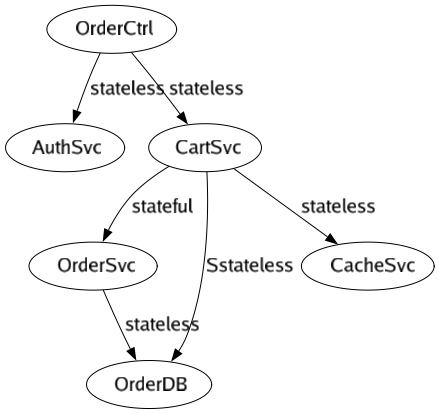

# testfuse - Guide to usage of library [fuse](https://github.com/rvauradkar1/fuse)

<ol>
<li><a href="#part1">Usage of Package fuse</a></li>
<div>
<ol>
<li><a href="#fuse1">Declare components and configure dependencies</a></li>
<li><a href="#fuse2">Create a config package to avoid cyclic dependencies</a></li>
<li><a href="#fuse3">Create a slice of component entries</a></li>
<li><a href="#fuse4">Register and fuse the components (Dependency Injection pattern)</a></li>
<li><a href="#fuse5">Provide a finder to find stateful components (Resource Locator pattern)</a></li>
</ol>
</div>
<li><a href="#part2">Usage of Package mock</a></li>
<div>
<ol>
<li><a href="#mock1">Create a main_test.go file with a Test_Generate method</a></li>
<li><a href="#mock2">Instantiate "mock"</a></li>
<li><a href="#mock3">Register Component Entries</a></li>
<li><a href="#mock4">Generate Mocks</a></li>
</ol>
</div>
<li><a href="#part3">Writing Unit Tests</a></li>
<ol>
<li><a href="#t1">Create Component Instance</a></li>
<li><a href="#t2">Mock Methods</a></li>
<li><a href="#t3">Execute Logic</a></li>
<li><a href="#t4">Capturing Method Calls and Parameters</a></li>
</ol>
</ol>

Simple project to demonstrate usage of the fuse and mock packages.  
These packages are available at the repo -  
[https://github.com/rvauradkar1/fuse](https://github.com/rvauradkar1/fuse)

The following component graph is used to demonstrate the usage of  
fuse/mock.  
Please review the package structure of this project - folders and  
sub-folders are provided to demonstrate wiring of components and  
generation of mocks to aid unit-testing.

A graph of the components is provided below.

1. The vertices represent components.
2. The edges represent dependencies.
3. The labels represent state.




<div id="part1"><h2>1. Usage of Package fuse</h3></div>

**API for fuse:**

```
// Fuse is used by clients to configure dependency injection (DI)  
type Fuse interface {  
    // Register a slice of components 
    Register(entries []Entry) []error 
    // Wire injects dependencies into components. 
    Wire() []error 
    // Find is needed only for stateful components. Can also be used for stateless in case dependencies are not defined at instance level  
    Find(name string) interface{}
}  
```

Steps to follow:

<ol>
<li><a href="#fuse1">Declare components and configure dependencies</a></li>
<li><a href="#fuse2">Create a config package to avoid cyclic dependencies</a></li>
<li><a href="#fuse3">Create a slice of component entries</a></li>
<li><a href="#fuse4">Register and fuse the components (Dependency Injection pattern)</a></li>
<li><a href="#fuse5">Provide a finder to find stateful components (Resource Locator pattern)</a></li>
</ol>


<div id="fuse1"><h3>1. Declare components and configure dependencies</h3></div>
Components are defined using `struct`.

Dependencies are configured using `struct` tags.

**Example 1 - Stateless dependencies**: The code below defines a `struct`. This component depends on 2 other components (look at  
the component graph above)

1. CartSvc (pointer variable) - tagged with key _fuse and the name of  
   the component.
2. AuthSvc (interface variable) - tagged with key _fuse and the name of  
   the component.

```
type OrderController struct {  
    CartSvc *cart.CartSvc `_fuse:"CartSvc"` 
    AuthSvc auth.IService `_fuse:"AuthSvc"`
}  
```

**Example 2 - Stateful dependencies**: The code below defines a `struct`.

1. DEPS_ interface{} - tagged with key _deps and a comma-delimited string of stateful dependencies.
These are not mandatory for DI but are useful during mock code generation.
```
type CartSvc struct {
	DEPS_    interface{}    `_deps:"OrderSvc"`
}
```

<div id="fuse2"><h3>2. Create a config package to avoid cyclic dependencies</h3></div>

**Note:** Config package is needed for several reasons:

1. Application packages cannot refer to 'main'.
2. Go does not allow cyclical references.
3. Application packages do not need to import 'fuse', they will import  
   'cfg' and use just the 'find' method. Eases refactoring if projects  
   want to discontinue usage of 'fuse'.


Following diagrams shows a high-level dependency:
1. Application package 'main' depends on 'cfg' and 'fuse'. 'main'  
   provides 'cfg' with the list of component entries.
2. 'cfg' uses 'fuse', register and fuses the components together. The  
   'find' method from the 'fuse' package is assigned to the 'find'  
   method from the 'cfg' package. Other packages use this method without  
   importing 'fuse'
3. 'other packages' are all other application packages. They depend on  
   'cfg' and use only the 'find' method.


<div id="fuse3"><h3>3. Create a slice of component entries</h3></div>

The component slice is created in the application 'main' package. Helps  
in:
1. Isolating dependencies on the 'fuse' package.
2. One place to define the graph(s).
3. Multiple slices can be created in case of different component graphs.
4. 'mock' package uses these slices to create mock for unit-testing.

**Example:**

The code below is defined in the application main file. It can be named  
anything. This same method will be used by the mock generator. Each  
component entry is recorded as a fuse.Entry with properties:

1. Name : Unique identifier for the component. This same identifier is  
   used when defining the '_fuse' dependency.
2. State : Stateful or stateless. If stateless, the component instance  
   provided is always used, no new instances are created. If stateful, a  
   new instance is created for each use. If this component has  
   dependencies on other stateless components, they are recursively  
   populated as well.
3. Instance : A pointer to the `struct`, if it is not a pointer  
   variable, an erros is generated during registry process.


```
func main() {  
    fmt.Println("Hello testfuse") 
    entries := Entries() 
    errors := cfg.Fuse(entries) 
    ..........
}  

func Entries() []fuse.Entry {
	fmt.Println("Hello testfuse")
	entries := make([]fuse.Entry, 0)
	entries = append(entries, fuse.Entry{Name: "OrdCtrl", State: false, Instance: &ctrl.OrderController{}})
	entries = append(entries, fuse.Entry{Name: "CartSvc", State: false, Instance: &cart.CartSvc{}})
	entries = append(entries, fuse.Entry{Name: "AuthSvc", State: false, Instance: &auth.AuthSvc{}})
	entries = append(entries, fuse.Entry{Name: "CacheSvc", State: false, Instance: &cache.CacheSvc{}})
	entries = append(entries, fuse.Entry{Name: "DBSvc", State: false, Instance: &db.DBSvc{}})
	entries = append(entries, fuse.Entry{Name: "OrderSvc", State: true, Instance: &ord.OrderSvc{}})

	return entries
} 
```

**main():** Uses 'Entries()' and calls 'cfg.Fuse()'. 'cfg' registers and  
fuses.

```
entries := Entries()  
errors := cfg.Fuse(entries)  
```


<div id="fuse4"><h3>4. Register and fuse the components (Dependency Injection pattern)</h3></div>

Following code explains it step by step:


```
package cfg

import (
	"github.com/rvauradkar1/fuse/fuse"
)

// Find is used by application packages as a Resource Locator
var Find func(name string) interface{}

// Fuse is used by application main package to provide a list of compoenets to register and fuse
func Fuse(entries []fuse.Entry) []error {
	// Step 1. Instance of Fuse
	f := fuse.New()
	// Step 2. 'cfg.Find' now points to the 'fuse.Find'
	Find = f.Find
	// Step 3. Register entries
	errors := f.Register(entries)
	if len(errors) != 0 {
		return errors
	}
	// Step 4. Wire dependencies
	return f.Wire()
}
```


<div id="fuse5"><h3>5. Provide a finder to find stateful components (Resource Locator pattern)</h3></div>

Code snippet from above provides this functionality:

```
// Find is used by application packages as a Resource Locator  
var Find func(name string) interface{}  
```

```
// 'cfg.Find' now points to the 'fuse.Find'  
Find = f.Find  
```


<div id="part2"><h2>2. Usage of Package mock</h3></div>

**API for mock:**

```
type Mock interface {  
    // Register a slice of components 
    Register(entries []fuse.Entry) []error 
    // Generates mocks 
    Generate() []error
}  
```

The graph below shows how the mock code generation is laid out.

1. main_test.go - Test file for the application main. It depends on the  
   'mock' package. It uses the 'Entries' method of 'main.go' to register  
   the components.
2. main.go - The application main file that supplies the component  
   entries.
3. mock package - depends on the 'fuse' package.


### Mock code generation pattern

All mocks are generated based on a fixed pattern and available in a Go file
named mocks_test.go.

'AuthSvc' is a registered component. Clients of this package need to  
mock this dependency during unit-testing.


#### Component definition

```
package auth

import (
	"fmt"
	"time"
)

type IService interface {
	Auth(user string) error
}

type AuthSvc struct {
	t time.Duration
}

func (a *AuthSvc) Auth(user string) error {
	fmt.Printf("Auth for user [%s]\n", user)
	return nil
}
  
```

#### Mock Component definition


```
package auth

import (
	"time"
)

// Begin of mock for AuthSvc and its methods
type MockAuthSvc struct {
	t time.Duration
}

type Auth func(s1 string) error

var MockAuthSvc_Auth Auth

func (p *MockAuthSvc) Auth(s1 string) error {
	capture("MockAuthSvc_Auth", []interface{}{s1})
	return MockAuthSvc_Auth(s1)
}

// End of mock for AuthSvc and its methods

```

#### Struct mock

```
// Original  
type AuthSvc struct {  
    t time.Duration
}  
// Mock of Original  
type MockAuthSvc struct {  
    t time.Duration
}  
```

#### Method mock

```
// Method from interface  
type IService interface {  
    Auth(user string) error
 }  
 
// Method mock  
type Auth func(s1 string) error  
  
// Client provide a mock implementation  
var MockAuthSvc_Auth Auth  
  
func (p *MockAuthSvc) Auth(s1 string) error {  
    // Mocked method is used instead of real code 
    return MockAuthSvc_Auth(s1)
}  
 ```

Steps to follow:

<ol>
<li><a href="#mock1">Create a main_test.go file with a Test_Generate method</a></li>
<li><a href="#mock2">Instantiate "mock"</a></li>
<li><a href="#mock3">Register Component Entries</a></li>
<li><a href="#mock4">Generate Mocks</a></li>
</ol>

<div id="mock1"><h3>1. Create a main_test.go file with a Test_Generate method</h3></div>

```
package main

func Test_Generate(t *testing.T) {
	fmt.Println("Start mock generation....")
	.......
	fmt.Println("End mock generation....")
}
```

<div id="mock2"><h3>2. Instantiate "mock"</h3></div>

```
func Test_Generate(t *testing.T) {
	fmt.Println("Start mock generation....")
	// Instantiaze mock, "main" is the name of the directory where your application resides
	m := mock.New("main")
	......
	fmt.Println("End mock generation....")
}
```

<div id="mock3"><h3>3. Register Component Entries</h3></div>

```
func Test_Generate(t *testing.T) {
	fmt.Println("Start mock generation....")
	// Instantiaze mock, "main" is the name of the directory where your application resides
	m := mock.New("main")
	// Reuse the 'Entries' method from 'main.go'
	entries := Entries()
	// Register the entries, mocks are generated based upon the component structures
	errors := m.Register(entries)
	......
	fmt.Println("End mock generation....")
}
```

<div id="mock4"><h3>4. Generate Mocks</h3></div>
Final complete method

```
func Test_Generate(t *testing.T) {
	fmt.Println("Start mock generation....")
	// Instantiaze mock, "main" is the name of the directory where your application resides
	m := mock.New("main")
	// Reuse the 'Entries' method from 'main.go'
	entries := Entries()
	// Register the entries, mocks are generated based upon the component structures
	errors := m.Register(entries)
	if len(errors) != 0 {
		log.Fatal(errors)
	}
	// Generate the mocks
	errors = m.Generate()
	if len(errors) != 0 {
		log.Fatal(errors)
	}
	fmt.Println("End mock generation....")
}
```


<div id="part3"><h2>3. Writing Unit Tests</h2></div>

<ol>
<li><a href="#t1">Create Component Instance</a></li>
<li><a href="#t2">Mock Methods</a></li>
<li><a href="#t3">Execute Logic</a></li>
<li><a href="#t4">Capturing Method Calls and Parameters</a></li>
</ol>

<div id="t1"><h3>1. Create Component Instance</h3></div>

Following code creates a component instance and intializes the mocked dependencies.
```
func Test_SaveOrder(t *testing.T) {
	// Make instance and initialize mocked dependencies.
	svc := OrderSvc{DBSvc: &MockDBSvc{}, CacheSvc: &MockCacheSvc{}}
    .......
}
```

<div id="t2"><h3>2. Mock Methods</h3></div>

```
func Test_SaveOrder(t *testing.T) {
   	// Make instance and initialize mocked dependencies.
	svc := OrderSvc{DBSvc: &MockDBSvc{}, CacheSvc: &MockCacheSvc{}}
	// Mock dependent methods.
	MockDBSvc_AddOrder = func(order string) error { return nil }
	MockCacheSvc_AddOrd = func(cart string, status string) error { return nil }
    .........
}
```

<div id="t3"><h3>3. Execute Logic</h3></div>

Call `svc.SaveOrder`

```
func Test_SaveOrder(t *testing.T) {
   	// Make instance and initialize mocked dependencies.
	svc := OrderSvc{DBSvc: &MockDBSvc{}, CacheSvc: &MockCacheSvc{}}
	// Mock dependent methods.
	MockDBSvc_AddOrder = func(order string) error { return nil }
	MockCacheSvc_AddOrd = func(cart string, status string) error { return nil }
	// Execute logic
	err := svc.SaveOrder("new order", "stats")
	// Error handling omitted
	fmt.Println(err)
	........
}
```

<div id="t4"><h3>4. Capture Method Calls and Parameters</h3></div>

The generated code provided a method called 'Calls' with signature:

```
type Params []interface{}

func Calls(name string) []Params
```
Tests call this method to ensure that dependent method was called. A slice of parameters is returned.
These are the parameters passed to the method. Multiple called to dependent  
method result in slice length > 1.


```
func Test_SaveOrder(t *testing.T) {
	// Make instance and initialize mocked dependencies.
	svc := OrderSvc{DBSvc: &MockDBSvc{}, CacheSvc: &MockCacheSvc{}}
	// Mock dependent methods.
	MockDBSvc_AddOrder = func(order string) error { return nil }
	MockCacheSvc_AddOrd = func(cart string, status string) error { return nil }
	// Execute logic
	err := svc.SaveOrder("new order", "stats")
	// Error handling omitted
	fmt.Println(err)
	// Ensure call to MockDBSvc_AddOrder was made
	fmt.Println("Number of calls to MockDBSvc_AddOrder = ", NumCalls("MockDBSvc_AddOrder"))
	// Print params passed to MockDBSvc_AddOrder
	for i, c := range CallParams("MockDBSvc_AddOrder") {
		fmt.Println(" Call Number ", i, " Params` = ", c)
	}
	// Ensure call to MockCacheSvc_AddOrd was made
	fmt.Println("Number of calls to MockCacheSvc_AddOrd = ", NumCalls("MockCacheSvc_AddOrd"))
	// Print params passed to MockCacheSvc_AddOrd
	for i, c := range CallParams("MockCacheSvc_AddOrd") {
		fmt.Println(" Call Number ", i, " Params` = ", c)
	}
}
```


